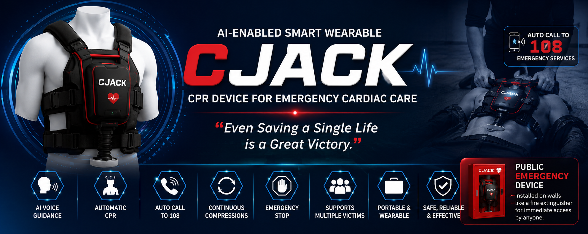
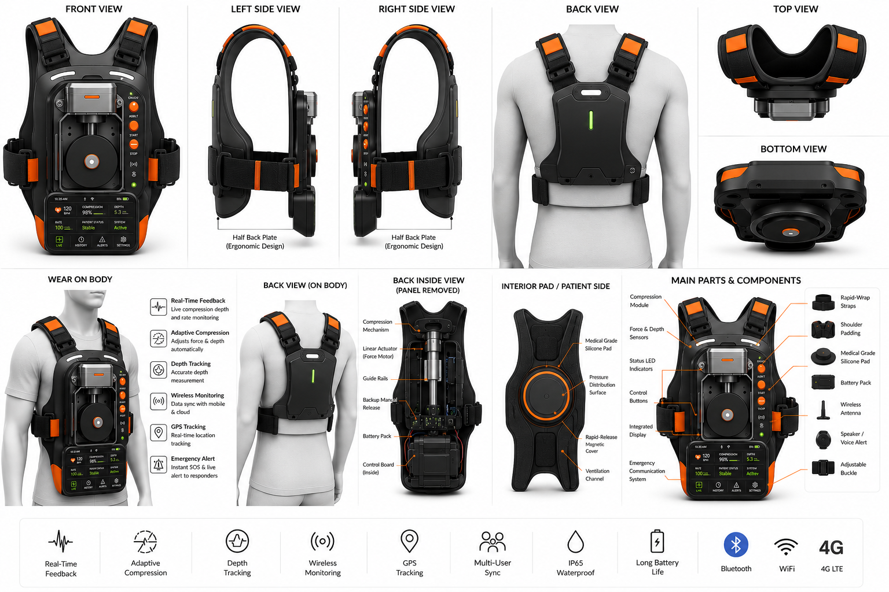
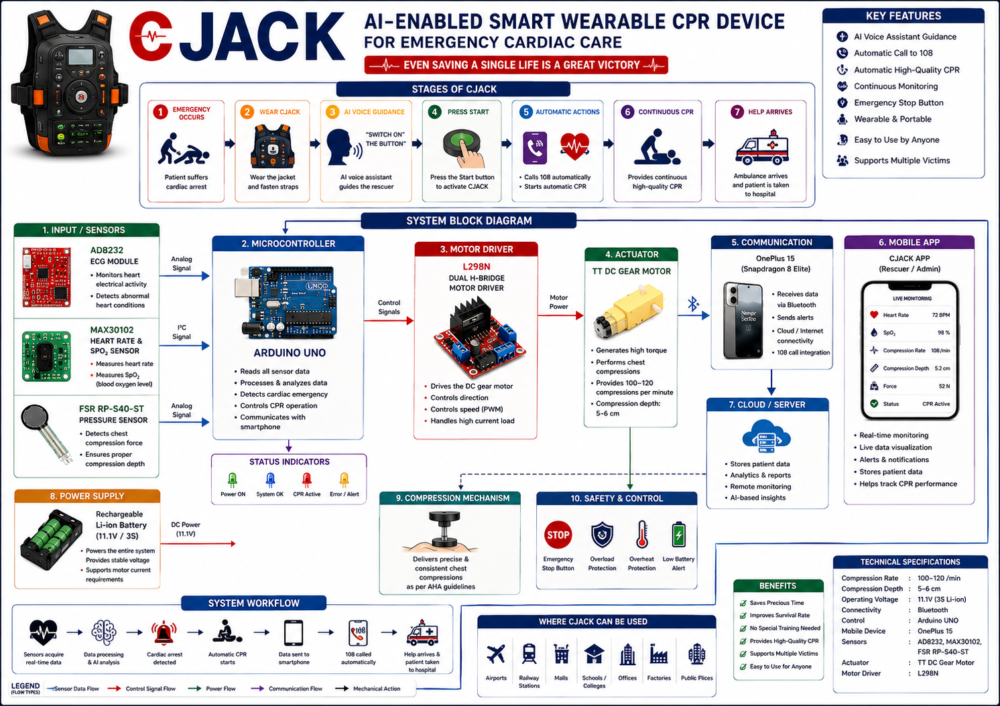

# CJACK

## AI-Enabled Smart Wearable CPR Device for Emergency Cardiac Care

> **"Even Saving a Single Life is a Great Victory."**
## Overview

CJACK (Cardiac Jacket) is an AI-enabled smart wearable CPR device designed to provide immediate automated chest compressions during Sudden Cardiac Arrest (SCA) before emergency medical services arrive. The system integrates a wearable compression mechanism, AI-guided voice assistance, and emergency communication to enable rapid intervention in public spaces. By making CPR more accessible and reducing rescuer fatigue, CJACK aims to improve emergency response and increase the chances of survival.
## Problem Statement

Sudden Cardiac Arrest is one of the leading causes of preventable death worldwide. Survival depends heavily on the rapid initiation of high-quality CPR. However, timely intervention is often limited by:

- Lack of CPR knowledge among the general public
- Delayed emergency response
- Rescuer fatigue during prolonged CPR
- Inconsistent compression quality
- Limited availability of automated CPR devices outside hospitals
- Difficulty managing multiple victims during emergency situations

These challenges highlight the need for an accessible, portable, and intelligent CPR solution.

## 3D Design

The following 3D model illustrates the conceptual design of **CJACK**, an AI-enabled smart wearable CPR device for emergency cardiac care. The design demonstrates the proposed wearable form factor and the integration of the automated chest compression mechanism.

## System Architecture

The following diagram presents the overall architecture of the CJACK system, illustrating the interaction between sensing, control, actuation, communication, and safety modules.

## Key Features

CJACK integrates intelligent automation, wearable technology, and emergency response capabilities into a single portable device.

| Feature | Description |
|---------|-------------|
| AI Voice Guidance | Provides step-by-step instructions to assist the rescuer during deployment. |
| Automated Chest Compressions | Delivers continuous chest compressions after activation. |
| Wearable Design | Designed to be quickly secured around the patient for rapid deployment. |
| Emergency Calling | Initiates an emergency call to 108 after activation (planned/implemented as applicable). |
| Continuous CPR | Reduces interruptions by maintaining automated compressions. |
| Emergency Stop | Allows immediate termination of operation when required. |
| Portable Deployment | Suitable for installation in public locations for rapid access. |
| Multi-Victim Support | Multiple CJACK units can be deployed simultaneously during mass-casualty incidents. |

## Hardware Components

The current CJACK prototype is built using the following hardware components:

| Component | Purpose |
|-----------|---------|
| Arduino UNO Q| Main microcontroller responsible for sensor processing and system control |
| L298N Motor Driver | Drives and controls the TT DC Gear Motor |
| TT DC Gear Motor | Generates the mechanical motion required for chest compressions |
| AD8232 ECG Module | Monitors the patient's ECG signals for cardiac activity |
| MAX30102 Sensor | Measures heart rate and blood oxygen saturation (SpO₂) |
| FSR RP-S40-ST Pressure Sensor | Detects compression force to help monitor CPR quality |
| OnePlus 15 (Snapdragon 8 Elite) | Mobile interface for communication, monitoring, and emergency functions |
| Rechargeable Li-ion Battery | Portable power source for the system |

## Software Stack

- Arduino App Lab 
- AI Voice Guidance Logic
- Bluetooth / Wi-Fi Communication
- Mobile Application

  ## Applications

CJACK is designed for deployment in environments where rapid access to emergency CPR can significantly improve patient outcomes. The following illustration highlights representative deployment locations for the proposed system.

## Innovation

CJACK introduces a new approach to emergency cardiac care by combining wearable technology, automated chest compressions, AI-guided assistance, and public accessibility into a single portable system.

Unlike conventional mechanical CPR devices that are primarily designed for hospital use, CJACK is intended for deployment in public environments, enabling immediate intervention before emergency medical services arrive.

A distinguishing aspect of the proposed system is its ability to support multiple victims when multiple CJACK units are available. During mass-casualty incidents, responders can deploy wearable CPR devices on different patients, allowing continuous automated chest compressions while attending to additional victims.

## Disclaimer

CJACK is a prototype developed for academic research and hackathon purposes. It is not a certified medical device and is not intended to replace professional medical equipment or emergency medical services. Any real-world deployment would require comprehensive engineering validation, clinical evaluation, and regulatory approval.

## Team

**Project:** CJACK – AI-Enabled Smart portable CPR jacket for Emergency Cardiac Care

**Team Members:**

- TWINAAGASH C
- VARSHINI B
- UDHAYARAGAVAN C

**Hackathon:** SNAPDRAGON MULTIVERSE HACKATHON

## Documentation

The following documents provide detailed information about the CJACK project.

- 📄 [Project Report (Word)](docs/CJACK_Project_Report.docx)
- 📊 [Presentation](docs/CJACK_Presentation.pptx)

